---

   Mahesh ATX > developer • builder • problem solver _" />

  
  

---

<h1 align="left"><samp> About </samp></h1>
<h3><samp>
<b>&gt; ./execute_profile.sh</b>  
Name&nbsp;&nbsp;&nbsp; : Mahesh 
Handle&nbsp; : @mahesh-atx 
Mission : "Always building something better than yesterday 🚀" 
Focus&nbsp;&nbsp; : [Data Science, AI/ML, Full-Stack] 
Style&nbsp;&nbsp; : "Clean architecture, dark UI, meaningful commits"
</samp></h3>

---

<h1 align="left"><samp> Stack </samp></h1>

<samp>Here are the languages, frameworks, and tools I use to build intelligent systems:</samp>

<table align="center" cellpadding="8">
  <tr>
    <td align="center"></td>
    <td align="center"></td>
    <td align="center"></td>
    <td align="center"></td>
    <td align="center"></td>
    <td align="center"></td>
    <td align="center"></td>
    <td align="center"></td>
  </tr>
  <tr>
    <td align="center"></td>
    <td align="center"></td>
    <td align="center"></td>
    <td align="center"></td>
    <td align="center"></td>
    <td align="center"></td>
    <td align="center"></td>
    <td align="center"></td>
  </tr>
  <tr>
    <td align="center"></td>
    <td align="center"></td>
    <td align="center"></td>
    <td align="center"></td>
    <td align="center"></td>
    <td align="center"></td>
    <td align="center"></td>
  </tr>
</table>

---

<h1 align="left"><samp> Stats </samp></h1>

  

---

<h1 align="left"><samp> Contributions </samp></h1>

  

---

<h1 align="left"><samp> Connect </samp></h1>

  
  
  
  

  

 <samp><i>Thanks for stopping by — let's build something great. ⭐</i></samp> 

 

  
  

---
