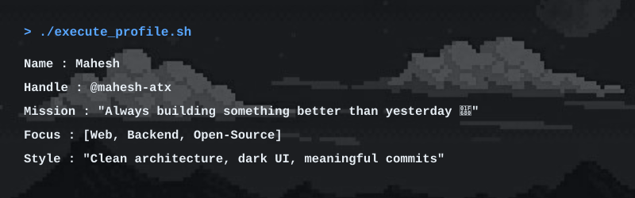

  

<h1>&gt; <samp>Mahesh ATX</samp></h1>
<h3>
  <samp>&gt; developer • builder • problem solver _</samp>
</h3>

  
  
  

---

<h1 align="left"><samp> About </samp></h1>

  

<h1 align="left"><samp> Stack </samp></h1>

<samp>Here are the languages, frameworks, and tools I use to build scalable applications:</samp>

  

<h1 align="left"><samp> Stats </samp></h1>

 

  

<h1 align="left"><samp> Contributions </samp></h1>

  

 

<h1 align="left"><samp> Connect </samp></h1>

  
  
  
  
  

  

